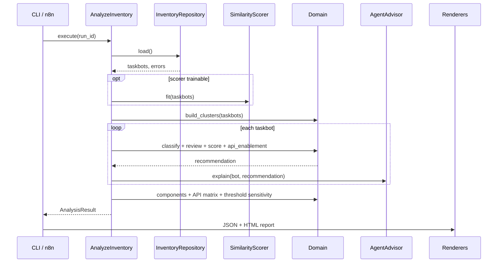
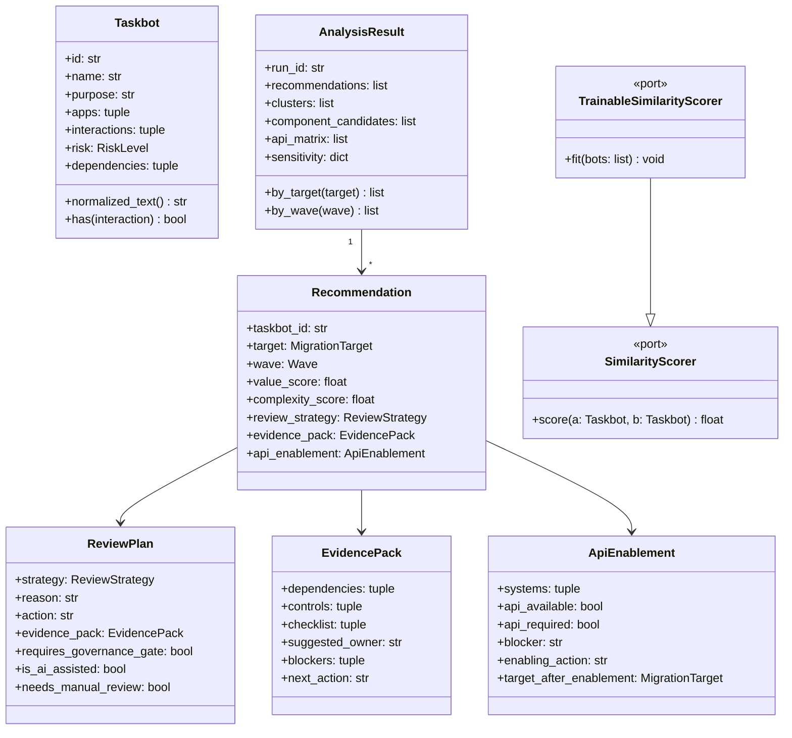

# Arquitectura y decisiones

Documento compacto de diseno. Resume arquitectura, reglas y diagramas; los registros formales de
decision se conservan en `docs/adr/` para trazabilidad ante evaluacion.

## Objetivo

Clasificar taskbots RPA en un plan accionable:

- consolidar variantes,
- elegir destino tecnologico (`n8n`, `microservice`, `custom_python_java`, `rpa_selective`),
- priorizar por ola,
- separar revision asistida de revision manual profunda,
- explicar cada decision con evidencia auditable.

## Arquitectura

La solucion usa un monolito modular con arquitectura hexagonal ligera.

```text
interface      CLI Typer, FastAPI
application    AnalyzeInventory + ports
domain         entities, rules, review, scoring, similarity, api_enablement
infrastructure repositories, renderers, config, logging, advisor, RapidFuzz
```

El dominio no hace I/O. El caso de uso depende de puertos, y los adaptadores viven en
`infrastructure`. Esto mantiene las reglas testeables y permite cambiar fuente de inventario,
renderers u orquestador sin tocar el nucleo.

## Flujo principal



## Modelo resumido



`TrainableSimilarityScorer` existe para scorers que necesitan calibrarse con todo el portafolio.
`RapidFuzzSimilarity.fit(bots)` detecta aplicaciones hub para que SAP, Outlook o SharePoint no
inflen falsos positivos de similitud.

## Reglas de negocio

| Regla | Decision |
|---|---|
| Sin interaccion reconocida | revision manual profunda |
| UI legacy | RPA selectivo |
| Cluster grande sin legacy | microservice |
| Base de datos sin legacy | custom Python/Java |
| API, archivo o email | n8n |
| Alto riesgo + dependencias relevantes | gate de gobierno |
| Valor alto + complejidad baja + sin gate | Ola 1 |
| Valor medio/alto + complejidad controlada | Ola 2 |
| Resto | Ola 3 |

## Decisiones de arquitectura

Los ADRs completos estan en `docs/adr/`. Resumen:

1. **Hexagonal ligera**: suficiente separacion sin convertir una PoC en microservicios.
2. **Reglas deterministas**: mismas entradas producen mismas decisiones; el resultado es explicable.
3. **Similitud multi-senal**: evidencia declarada, apps no hub y texto; evita duplicados falsos por
   herramientas comunes.
4. **Agente opcional**: el LLM puede redactar mejor, pero no cambia decisiones y tiene fallback.
5. **n8n desacoplado**: n8n orquesta `POST /analyze`; puede reemplazarse por Appian, Power Platform
   o un BPM sin cambiar dominio.

## Seguridad y recuperacion

- Sin secretos en codigo.
- `TASKBOT_INVENTORY_ROOT` limita rutas aceptadas por `/analyze`.
- `/analyze/inline` evita exponer rutas locales.
- El servicio es stateless y de solo lectura sobre el inventario.
- Recuperacion ante fallo: corregir entrada/configuracion y volver a ejecutar.
- Cada corrida escribe en `reports/<run_id>/`.

## Validacion

La evidencia viva esta en `docs/evidencia_pruebas.txt`. La compuerta de CI ejecuta:

- tests,
- verificacion de OpenAPI,
- drift check del reporte ejemplo,
- `docker compose config`,
- smoke de n8n importando y ejecutando el workflow local.
