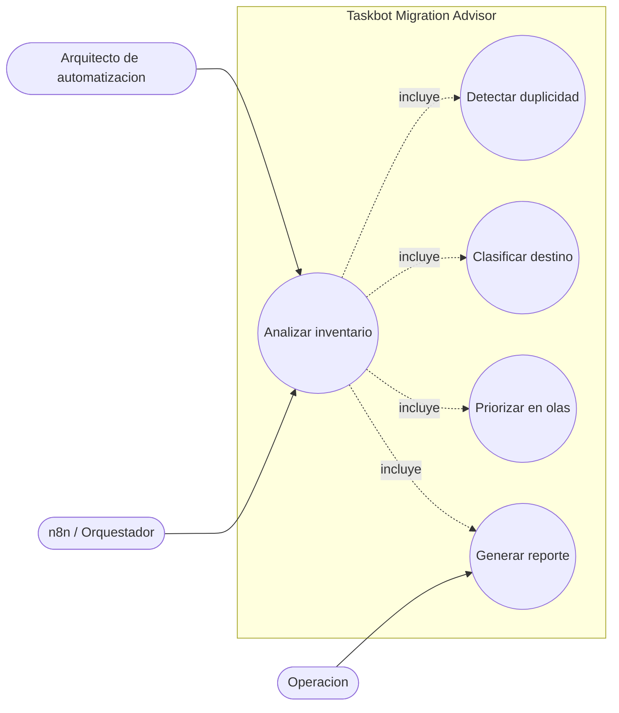
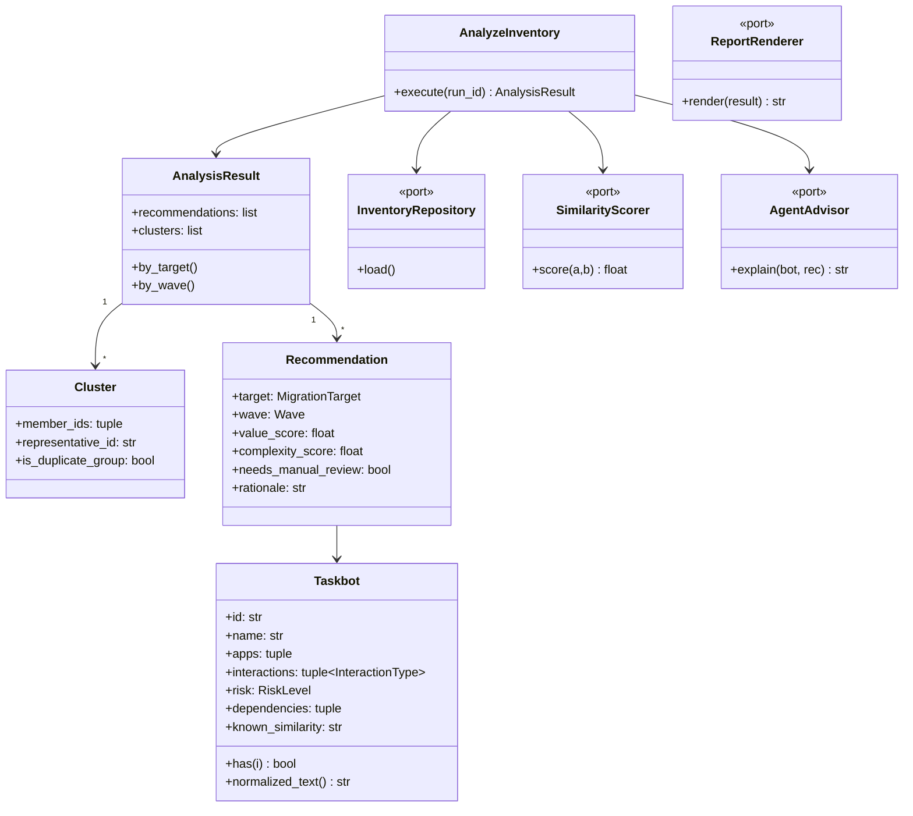
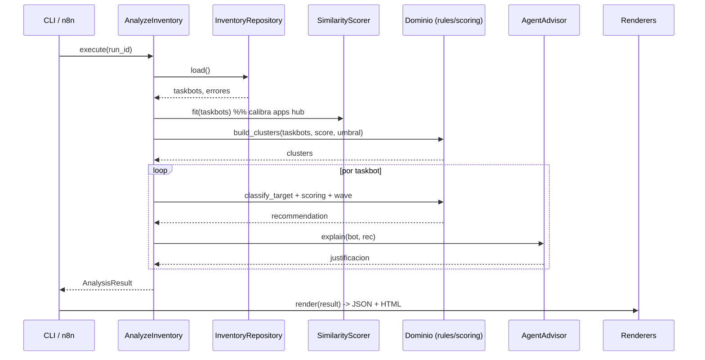
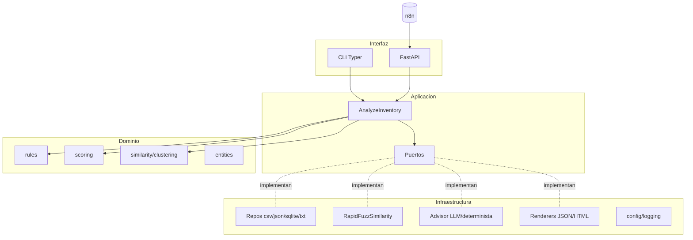
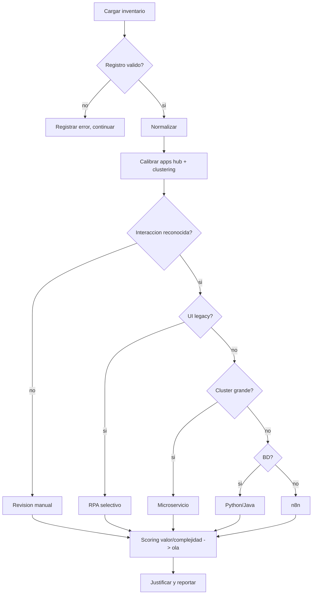

# Diagramas UML

## Casos de uso

```mermaid
flowchart LR
    arq([Arquitecto de automatizacion])
    ops([Operacion])
    n8n([n8n / Orquestador])
    subgraph Sistema[Taskbot Migration Advisor]
      uc1((Analizar inventario))
      uc2((Detectar duplicidad))
      uc3((Clasificar destino))
      uc4((Priorizar en olas))
      uc5((Generar reporte))
    end
    arq --> uc1
    ops --> uc5
    n8n --> uc1
    uc1 -.incluye.-> uc2
    uc1 -.incluye.-> uc3
    uc1 -.incluye.-> uc4
    uc1 -.incluye.-> uc5
```

## Clases (dominio + aplicación + puertos)

```mermaid
classDiagram
    class Taskbot {
      +id: str
      +name: str
      +apps: tuple
      +interactions: tuple~InteractionType~
      +risk: RiskLevel
      +dependencies: tuple
      +known_similarity: str
      +has(i) bool
      +normalized_text() str
    }
    class Cluster {
      +member_ids: tuple
      +representative_id: str
      +is_duplicate_group: bool
    }
    class Recommendation {
      +target: MigrationTarget
      +wave: Wave
      +value_score: float
      +complexity_score: float
      +needs_manual_review: bool
      +rationale: str
    }
    class AnalysisResult {
      +recommendations: list
      +clusters: list
      +by_target()
      +by_wave()
    }
    class AnalyzeInventory {
      +execute(run_id) AnalysisResult
    }
    class InventoryRepository {
      <<port>>
      +load()
    }
    class SimilarityScorer {
      <<port>>
      +score(a,b) float
    }
    class AgentAdvisor {
      <<port>>
      +explain(bot, rec) str
    }
    class ReportRenderer {
      <<port>>
      +render(result) str
    }

    AnalyzeInventory --> InventoryRepository
    AnalyzeInventory --> SimilarityScorer
    AnalyzeInventory --> AgentAdvisor
    AnalyzeInventory --> AnalysisResult
    AnalysisResult "1" --> "*" Recommendation
    AnalysisResult "1" --> "*" Cluster
    Recommendation --> Taskbot
```

## Secuencia (flujo principal)

```mermaid
sequenceDiagram
    participant U as CLI / n8n
    participant UC as AnalyzeInventory
    participant R as InventoryRepository
    participant S as SimilarityScorer
    participant D as Dominio (rules/scoring)
    participant A as AgentAdvisor
    participant W as Renderers

    U->>UC: execute(run_id)
    UC->>R: load()
    R-->>UC: taskbots, errores
    UC->>S: fit(taskbots)  %% calibra apps hub
    UC->>D: build_clusters(taskbots, score, umbral)
    D-->>UC: clusters
    loop por taskbot
        UC->>D: classify_target + scoring + wave
        D-->>UC: recommendation
        UC->>A: explain(bot, rec)
        A-->>UC: justificacion
    end
    UC-->>U: AnalysisResult
    U->>W: render(result) -> JSON + HTML
```

## Componentes

```mermaid
flowchart TB
    subgraph Interfaz
      CLI[CLI Typer]
      API[FastAPI]
    end
    subgraph Aplicacion
      UC[AnalyzeInventory]
      P[Puertos]
    end
    subgraph Dominio
      RULES[rules]
      SCORE[scoring]
      SIMD[similarity/clustering]
      ENT[entities]
    end
    subgraph Infraestructura
      REPO[Repos csv/json/sqlite/txt]
      SIM[RapidFuzzSimilarity]
      ADV[Advisor LLM/determinista]
      REND[Renderers JSON/HTML]
      CFG[config/logging]
    end
    CLI --> UC
    API --> UC
    UC --> P
    UC --> RULES & SCORE & SIMD
    P -. implementan .- REPO & SIM & ADV & REND
    n8n[(n8n)] --> API
```

## Actividad (lógica de negocio)

```mermaid
flowchart TD
    A[Cargar inventario] --> B{Registro valido?}
    B -- no --> E[Registrar error, continuar]
    B -- si --> C[Normalizar]
    C --> D[Calibrar apps hub + clustering]
    D --> F{Interaccion reconocida?}
    F -- no --> G[Revision manual]
    F -- si --> H{UI legacy?}
    H -- si --> I[RPA selectivo]
    H -- no --> J{Cluster grande?}
    J -- si --> K[Microservicio]
    J -- no --> L{BD?}
    L -- si --> M[Python/Java]
    L -- no --> N[n8n]
    G & I & K & M & N --> O[Scoring valor/complejidad -> ola]
    O --> P[Justificar y reportar]
```
