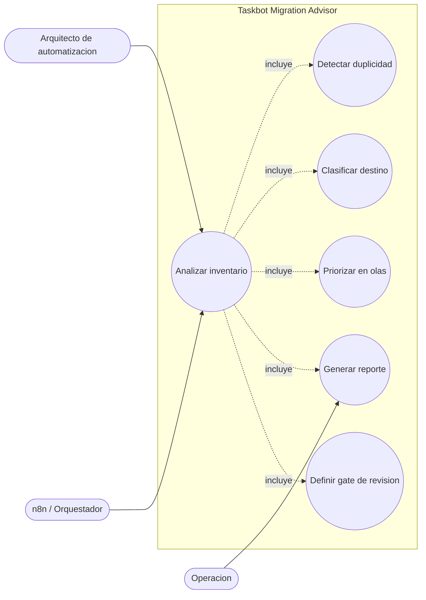
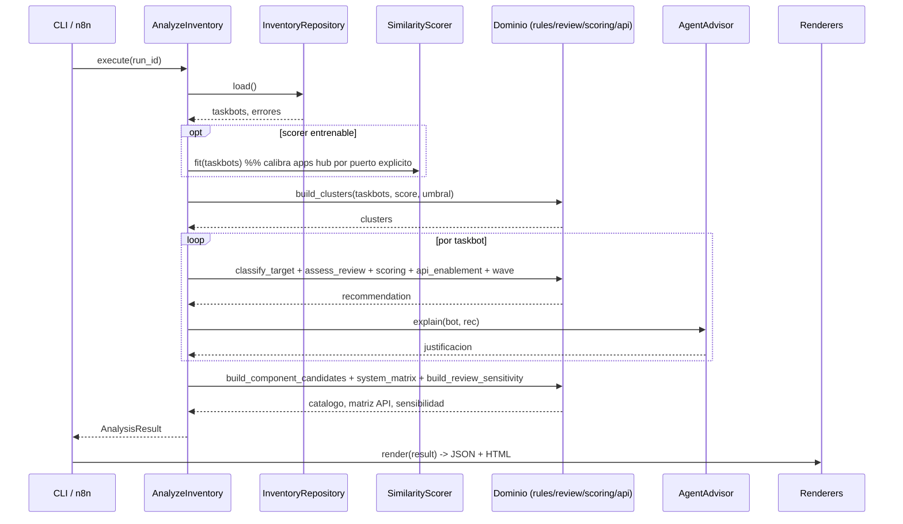
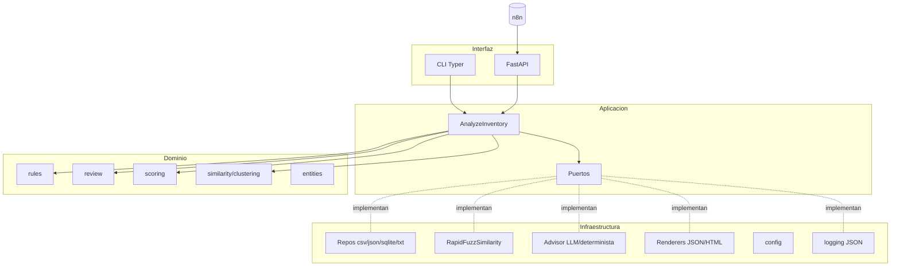
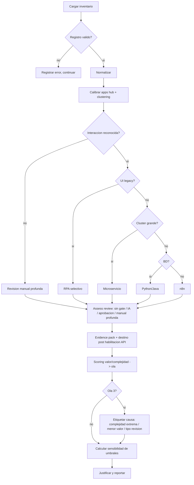

# Diagramas UML

## Casos de uso

## Clases (dominio + aplicación + puertos)

```mermaid
classDiagram
    class Taskbot {
      +id: str
      +name: str
      +purpose: str
      +apps: tuple
      +interactions: tuple~InteractionType~
      +frequency: str
      +risk: RiskLevel
      +dependencies: tuple
      +known_similarity: str
      +normalized_text() str
      +has(interaction) bool
      +known_interactions: tuple
    }
    class InteractionType {
      <<enum>>
      +parse(raw) InteractionType
      +parse_many(raw) tuple
    }
    class RiskLevel {
      <<enum>>
      +parse(raw) RiskLevel
    }
    class MigrationTarget {
      <<enum>>
      +N8N
      +MICROSERVICE
      +CUSTOM_PYTHON_JAVA
      +RPA_SELECTIVE
      +MANUAL_REVIEW
    }
    class Wave {
      <<enum>>
      +WAVE_1
      +WAVE_2
      +WAVE_3
    }
    class ReviewStrategy {
      <<enum>>
      +NONE
      +AI_PRECHECK
      +TARGETED_APPROVAL
      +MANUAL_DEEP_DIVE
    }
    class Cluster {
      +id: int
      +member_ids: tuple
      +representative_id: str
      +size: int
      +is_duplicate_group: bool
    }
    class Recommendation {
      +taskbot_id: str
      +taskbot_name: str
      +decision: MigrationDecision
      +scores: ScoreExplanation
      +rationale: str
      +api_enablement: ApiEnablement
      +evidence_pack: EvidencePack
      +target: MigrationTarget
      +wave: Wave
      +value_score: float
      +complexity_score: float
      +review_strategy: ReviewStrategy
      +requires_governance_gate: bool
      +ai_assisted_review: bool
      +needs_manual_review: bool
      +score_breakdown: dict
    }
    class MigrationDecision {
      +target: MigrationTarget
      +wave: Wave
      +cluster_id: int
      +reasons: tuple
      +review: ReviewPlan
      +needs_manual_review: bool
    }
    class ReviewPlan {
      +strategy: ReviewStrategy
      +reason: str
      +action: str
      +evidence_pack: EvidencePack
      +requires_governance_gate: bool
      +is_ai_assisted: bool
      +needs_manual_review: bool
    }
    class EvidencePack {
      +dependencies: tuple
      +controls: tuple
      +checklist: tuple
      +suggested_owner: str
      +blockers: tuple
      +next_action: str
    }
    class ScoreExplanation {
      +value: float
      +complexity: float
      +breakdown: dict
    }
    class ApiEnablement {
      +systems: tuple
      +api_available: bool
      +api_required: bool
      +blocker: str
      +enabling_action: str
      +target_after_enablement: MigrationTarget
    }
    class ComponentCandidate {
      +cluster_id: int
      +suggested_name: str
      +member_ids: tuple
      +member_names: tuple
      +common_purpose: str
      +target_pattern: MigrationTarget
      +dominant_apps: tuple
      +legacy_blocker: bool
      +needs_api_enablement: bool
      +recommended_action: str
      +size: int
    }
    class AnalysisResult {
      +run_id: str
      +recommendations: list
      +clusters: list
      +errors: list
      +component_candidates: list
      +api_matrix: list
      +sensitivity: dict
      +total: int
      +by_target(target) list
      +by_wave(wave) list
      +consolidation_groups: list
    }
    class AnalyzeInventory {
      +execute(run_id: str) AnalysisResult
    }
    class InventoryRepository {
      <<port>>
      +load() tuple
    }
    class SimilarityScorer {
      <<port>>
      +score(a: Taskbot, b: Taskbot) float
    }
    class TrainableSimilarityScorer {
      <<port>>
      +fit(bots: list) void
    }
    class AgentAdvisor {
      <<port>>
      +explain(bot: Taskbot, rec: Recommendation) str
    }
    class ReportRenderer {
      <<port>>
      +render(result: AnalysisResult) str
    }
    class RunLoggerFactory {
      <<port>>
      +for_run(run_id: str) RunLogger
    }
    class RunLogger {
      <<port>>
      +info(event: str, fields) void
      +error(event: str, fields) void
    }

    AnalyzeInventory --> InventoryRepository
    AnalyzeInventory --> SimilarityScorer
    AnalyzeInventory --> RunLoggerFactory
    AnalyzeInventory --> AgentAdvisor
    AnalyzeInventory --> AnalysisResult
    AnalysisResult "1" --> "*" Recommendation
    AnalysisResult "1" --> "*" Cluster
    AnalysisResult "1" --> "*" ComponentCandidate
    Recommendation --> MigrationDecision
    Recommendation --> ScoreExplanation
    Recommendation --> ApiEnablement
    MigrationDecision --> ReviewPlan
    ReviewPlan --> ReviewStrategy
    ReviewPlan --> EvidencePack
    ApiEnablement --> MigrationTarget
    Taskbot --> InteractionType
    Taskbot --> RiskLevel
    MigrationDecision --> MigrationTarget
    MigrationDecision --> Wave
    ComponentCandidate --> MigrationTarget
    TrainableSimilarityScorer --|> SimilarityScorer
    RunLoggerFactory --> RunLogger
```

`TrainableSimilarityScorer` existe para scorers que necesitan calibrarse con todo el portafolio
antes de comparar pares. En esta implementación `RapidFuzzSimilarity.fit(bots)` detecta aplicaciones
"hub" para que SAP/Outlook/SharePoint no inflen falsos positivos de similitud.

## Secuencia (flujo principal)

## Componentes

## Actividad (lógica de negocio)

